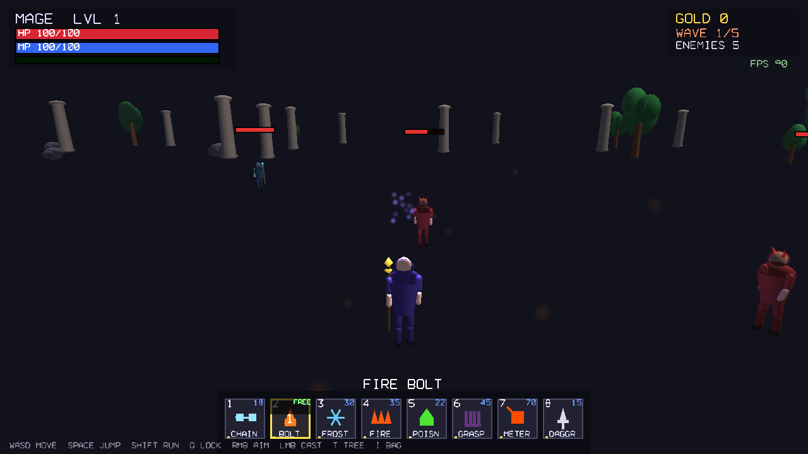

# Arcane Ascendant — A Third-Person Mage Action RPG in C++/OpenGL

A complete, **engine-free** 3D third-person action game written from scratch in
**C++17** with raw **OpenGL 3.3 Core**. No Unity, no Unreal, no Godot — every
system (renderer, procedural 3D models, animation, particles, UI, combat, AI,
progression) is hand-built. It runs fully **offline** and is designed to work
smoothly on **integrated GPUs** (Intel HD/UHD, AMD Vega) — **no NVIDIA / dedicated
GPU required**.

> Play as a mage, fight wave after wave of enemies that arrive phase-by-phase,
> master 8 distinct spells, climb an ability tree, get richer, and bring down a
> 3-phase **Archlich boss**.



---

## ▶️ Download & Play (Windows)

Grab the ready-to-run build from the [`build/`](build/) folder:

1. Download **`build/ArcaneAscendant.exe`**
2. **Double-click** it. That's it.

- No installer, no DLLs, no internet. Fully **offline**.
- Statically linked — depends only on standard Windows system DLLs.
- Needs only **OpenGL 3.3** (any PC from ~2012+).
- See [`build/HOW_TO_PLAY.txt`](build/HOW_TO_PLAY.txt) for full controls.

If Windows SmartScreen warns about an unsigned exe: **More info → Run anyway**.

---

## 🎮 Controls

| Input | Action |
|------|--------|
| `W A S D` | Move (forward / left / back / right) |
| Mouse | Rotate camera |
| Mouse Wheel | Zoom |
| `Space` | Jump |
| `Shift` | Sprint |
| `Q` | Lock-on nearest enemy (toggle) |
| `1`–`8` | Select spell/power |
| Right Mouse (hold) | Aim |
| Left Mouse | Cast / fire |
| `T` | Ability Tree |
| `I` | Inventory |
| `R` | Restart (on death/victory) |

## ✨ The 8 Spells

1. **Chain Link** — links nearby enemies; normal damage spreads across the chain.
2. **Fire Bolt** — free, 2s cooldown basic fire projectile.
3. **Frost Nova** — area freeze; freeze duration shown above frozen enemies.
4. **Inferno** — ignites an area; enemies burn over time.
5. **Poison Cloud** — green stacking poison DoT (more stacks = faster HP loss).
6. **Grasping Hands** — hands rise from the ground to grab, drag down & crush enemies.
7. **Meteor** — huge fireball hitting up to 10 enemies, big damage, big mana cost.
8. **Bleeding Dagger** — thrown blade causing stacking bleed.

Plus **passive** upgrades (Spell Power, Crit, max HP/Mana) in the ability tree.

---

## 🧱 Architecture

Everything is procedural — no model/texture/font asset files are shipped.

```
src/
  main.cpp            Window + OpenGL 3.3 context (GLFW + GLAD) + input wiring
  Shader.*            GLSL program wrapper
  Shaders.h           Embedded GLSL (lit / particle / UI / line shaders)
  Mesh.*              VAO/VBO/EBO mesh
  Geometry.*          Procedural solids (capsule, tapered cone, ellipsoid,
                      crystal, horn) — the building blocks for all models
  CharacterModel.*    Articulated procedural characters (mage, grunt, caster,
                      brute, boss) assembled from body-part meshes + bones
  Animation.*         Procedural locomotion + action poses (walk/run/jump/
                      cast/throw/slam/hurt/die) — no keyframe asset files
  Camera.h            Third-person orbit camera
  Particles.*         Instanced billboard particle system (spell VFX)
  LineRenderer.*      Batched 3D lines (chain links, lock ring, zone rings)
  UIRenderer.*        Immediate-mode 2D HUD + a built-in stroke vector font
  GameTypes.h         Abilities, enemies, projectiles, zones, items, pickups
  Game.h              Game class declaration
  Game_Setup.cpp      Init, world/model/ability construction, reset
  Game_Update.cpp     Player, enemies, phases, pickups update
  Game_Combat.cpp     The 8 spells, projectiles, zones, lock-on, progression
  Game_Render.cpp     World + character + effects rendering, lighting
  Game_HUD.cpp        HUD, ability bar, menus, world-space bars & markers
  Game_Input.cpp      Main loop + input callbacks
```

### No spheres/cubes
Models are built from **organic deformable primitives** (tapered cylinders,
ellipsoids, capsules, curved horns, faceted crystals) blended into coherent
silhouettes — a hooded mage with a glowing staff orb, horned brutes, and a
towering horned Archlich boss.

### Performance
- OpenGL 3.3 Core, single directional + point light, exponential fog.
- Instanced particles, batched lines, capped particle count.
- VSync on → smooth frame pacing, low GPU load. Hits well over 60 FPS even
  on the software (llvmpipe) renderer used in CI.

---

## 🔨 Building from source

### Windows `.exe` (cross-compiled from Linux with MinGW-w64)

```bash
sudo apt-get install -y cmake mingw-w64
mkdir build_win && cd build_win
cmake .. -DCMAKE_TOOLCHAIN_FILE=../mingw-toolchain.cmake -DCMAKE_BUILD_TYPE=Release
make -j$(nproc)
# -> build_win/bin/ArcaneAscendant.exe (static, portable)
```

### Native Linux (for testing)

```bash
sudo apt-get install -y cmake libglfw3-dev libgl1-mesa-dev
mkdir build_linux && cd build_linux
cmake .. -DCMAKE_BUILD_TYPE=Release
make -j$(nproc)
./bin/ArcaneAscendant
```

Dependencies (GLFW, GLAD, GLM) are vendored under `include/`, `libs/`, `external/`.

---

## 📜 License
Code is provided as-is for learning and play. GLFW, GLAD and GLM retain their
respective licenses.
